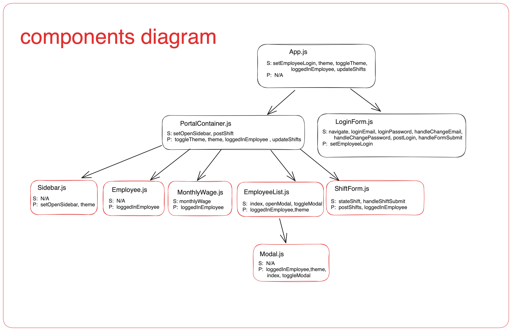
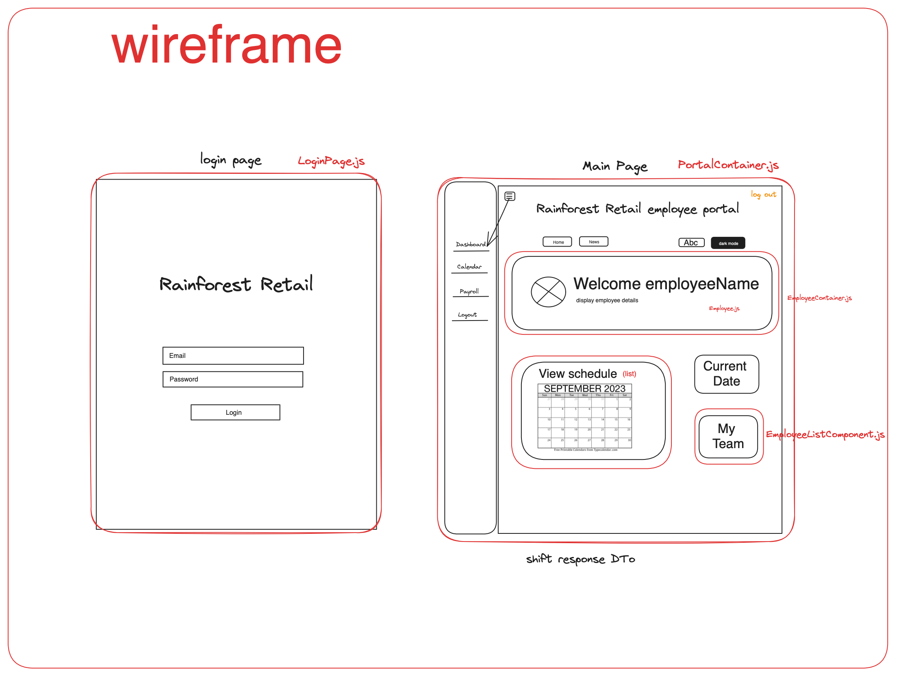
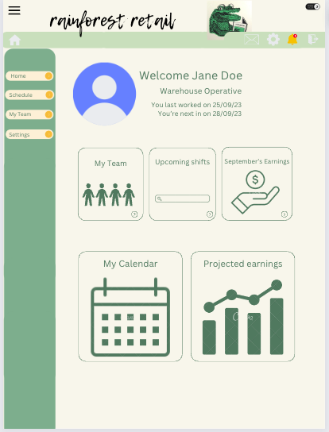
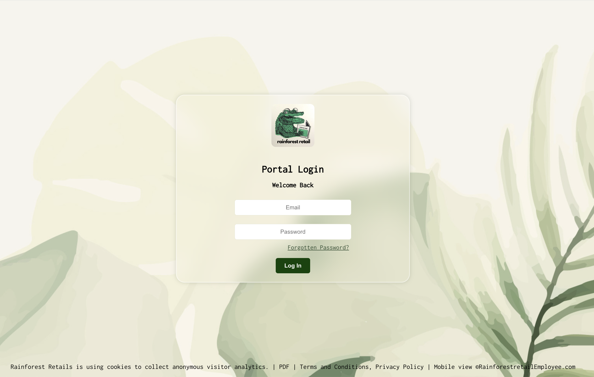
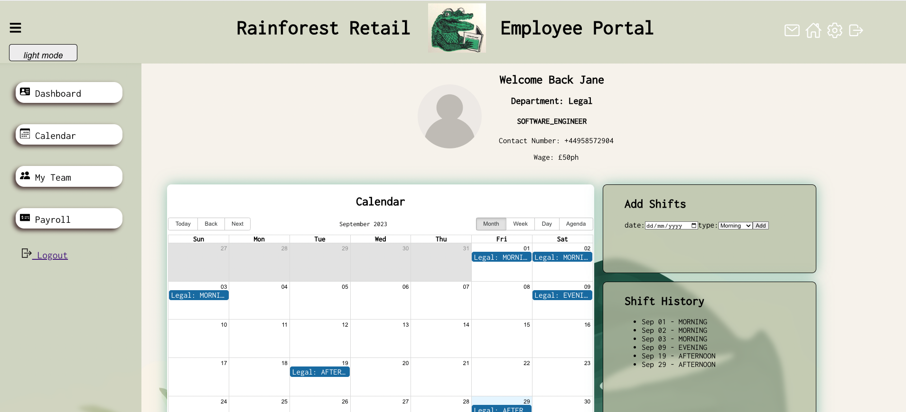
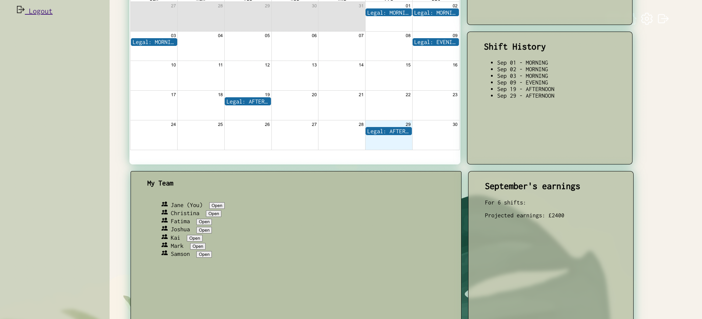
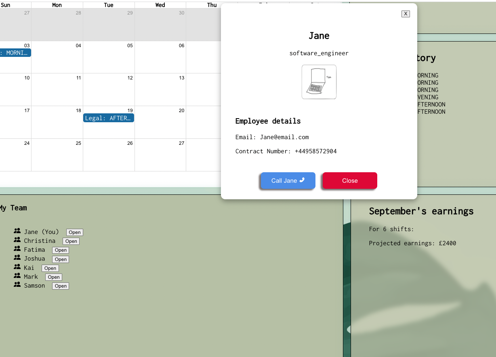
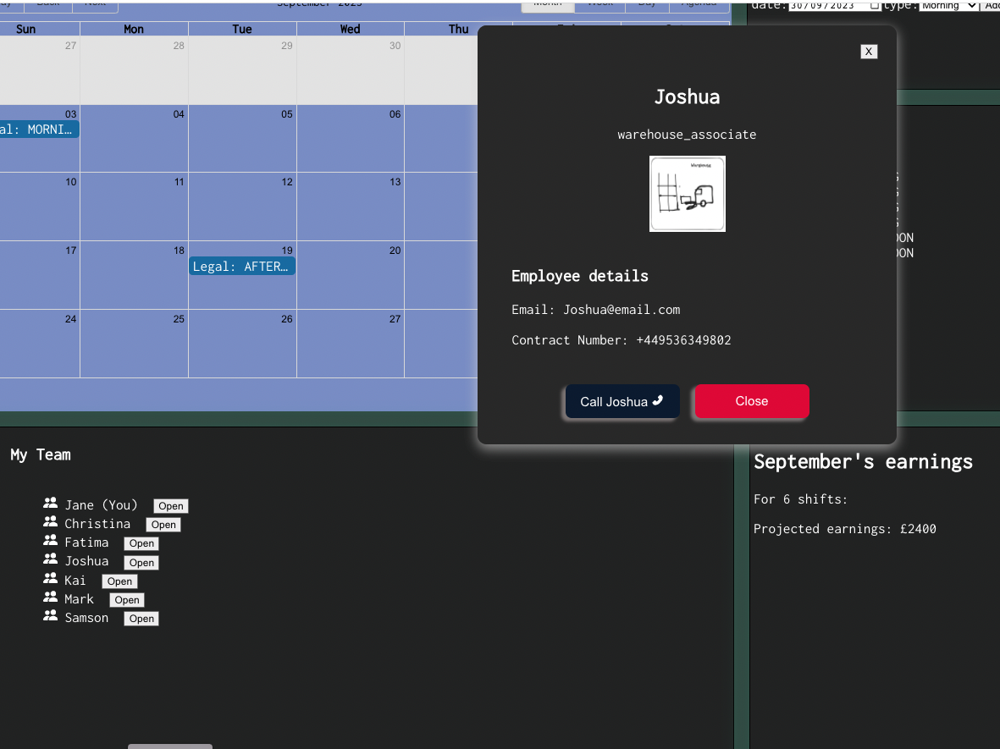

# Employee Portal - React app 

## **_Collaborators_**

- Georgia Crawford-Dellar (GitHub: [GeorgiaCD](https://github.com/GeorgiaCD))
- Francesca (GitHub: [Francescam31](https://github.com/Francescam31))
- Amélie (GitHub: [amelieboydshire](https://github.com/amelieboydshire))
- Blezzy Dela Cruz (GitHub: [blezzydcruz](https://github.com/blezzydcruz))

### Table of Contents

1. [Description](#description)
2. [The app's functions](#the-apps-functions)
3. [Components & Container Description](#components--container-description)
4. [Components Diagram](#components-diagram)
5. [Wireframe](#wireframe)
6. [API](#api)
7. [Demo video](#demon-video)
8. [Screenshots](#screenshots)
9. [Tech Stack](#tech-stack)

## Description

This project aimed to solve the inefficient record handling and the data discrepancies the company had by creating a full-stack application. 

We were given a buisness case and decided to solve the two following problems the company faced : 
1. Employee details are kept in paper records at head office
2. Separate diaries are used to keep track of holidays, changes in assignment and other important dates

Our solution was to built a multiple functional employee portal that aims to digitises employees records and schedules. In additon to viewing and editing their schedule employees have the ability to view shift history, view their projected earning for the current month and have a directory that displayed the contact details of the other employees in their department. 

## The app's functions

## Components & Container Description 

### Components Diagram
</img>

### Wireframes
</img>

</img>

### API

https://github.com/GeorgiaCD/Employee_Portal_Backend

## Demo video

## Screenshots
<h4>Login Page</h4>
</img>

<h4>Portal Page</h4>

</img>

</img>

<h4>Employee Detail Modals</h4>
<h4>Light Mode</h4>

<!-- </img> -->

<h4>Dark Mode</h4>
<!-- </img> -->

# Tech Stack
### React
React libraries 
- react-router-dom
- react-big-calendar
- react-icons
- ionicons
